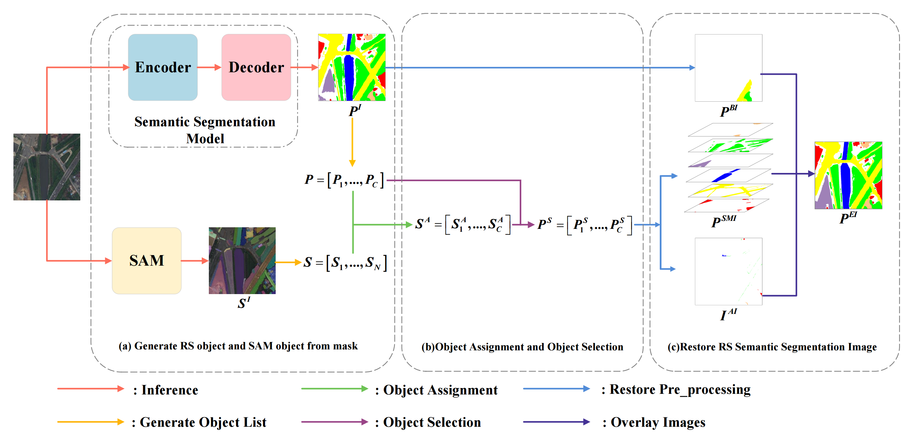
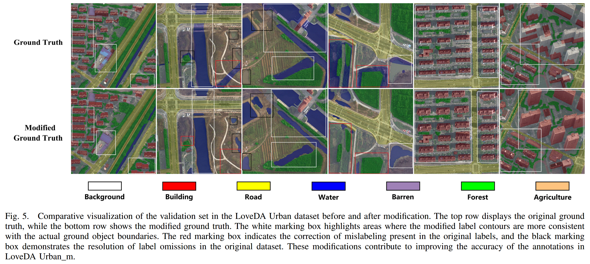

# SAM Enhanced Semantic Segmentation for Remote Sensing Imagery Without Additional Training

## 🚀 Project Overview

Semantic segmentation models for remote sensing imagery often suffer from issues such as fragmented predictions and inaccurate boundaries due to label inaccuracies. This project introduces a **simple yet effective framework** to enhance segmentation results using **Segment Anything Model (SAM)** and other general-purpose vision models **without additional training**.



### 🔹 Key Features:

- **Boundary Enhancement**: Uses precise SAM masks to refine the shape of segmentation masks.
- **No Additional Training Required**: Works as a **post-processing step** without modifying the segmentation model.
- **Universal Applicability**: Proven effective on **LoveDA Urban** and **ISPRS Potsdam** datasets.
- **Scalable with Better Vision Models**: Performance improves as **SAM-HQ** and **Semantic-SAM** advance.

[[📜 ](https://ieeexplore.ieee.org/document/10857947)[**Paper**](https://ieeexplore.ieee.org/document/10857947)]


This repository provides the code for **GeoSeg** (semantic segmentation model training), **SAM** (automatic mask generation from foundation models), and **SESSRS** (our proposed post-processing algorithm).

---

## ⚙️ Installation

### 1️⃣ Clone the Repository

```bash
git clone https://github.com/qycools/SESSRS.git
cd SESSRS
```

### 2️⃣ Set Up Environments

#### 📌 GeoSeg (Semantic Segmentation Model)

```bash
conda create -n env_SESSRS_GeoSeg python=3.8
conda activate env_SESSRS_GeoSeg
pip3 install torch torchvision torchaudio --index-url https://download.pytorch.org/whl/cu118
pip install -r requirements_GeoSeg.txt
```

#### 📌 SAM & SESSRS

```bash
conda create -n env_SESSRS_SAM python=3.9
conda activate env_SESSRS_SAM
pip3 install torch==1.13.1 torchvision==0.14.1 --extra-index-url https://download.pytorch.org/whl/cu113
conda install -c "nvidia/label/cuda-11.7.1" cuda-toolkit
python -m pip install 'git+https://github.com/MaureenZOU/detectron2-xyz.git'
pip install git+https://github.com/cocodataset/panopticapi.git
python -m pip install -r requirements_SAM.txt
cd SAM/semantic_sam/body/encoder/ops
python setup.py build install --user
```

---

## 📂 Datasets

### 🔹 LoveDA Urban

- [Official GitHub](https://github.com/Junjue-Wang/LoveDA)
- **Processed Dataset** ([Baidu Netdisk Download](https://pan.baidu.com/s/1pJhxwH_Rp-YdNkH4hnjnyw?pwd=SERS))


#### 🛠 Label Improvements

We refined **water** and **building** labels using [Label Studio](https://github.com/HumanSignal/label-studio) for better evaluation of segmentation accuracy. The modifications primarily affect the **water** and **building** labels. While the LoveDA dataset already has high label accuracy compared to other remote sensing datasets, there are still minor discrepancies with real-world object boundaries. To better evaluate our method, we made slight adjustments to these labels. However, labeling remote sensing imagery is inherently challenging due to the ambiguity of certain objects and the difficulty in delineating boundaries. The modified **water** and **building** labels are estimated to be over **98%** accurate for Urban areas and over **90%** for Rural areas.




### 🔹 ISPRS Potsdam

- [Official Dataset](https://www.isprs.org/education/benchmarks/UrbanSemLab/semantic-labeling.aspx)
- **Processed Dataset** ([Baidu Netdisk Download](https://pan.baidu.com/s/1iezuouN7DdhLbwQHyoPDtA?pwd=SERS))

📌 **Note:** The Potsdam dataset includes `masks` and `masks_eroded` in the `val` directory. Note that many studies train their models using `masks` but validate using `masks_eroded`, which typically improves accuracy by **2-3 points** by ignoring boundary ambiguity. In this work, we train and validate using `masks`.

---

## 📥 Model Weights

- **GeoSeg Weights** → Extract to `/GeoSeg` ([Baidu Netdisk Download](https://pan.baidu.com/s/1p6t02G0dgerQX3Vyo0gr-g?pwd=sers))
- **SAM Weights** → Extract to `/SAM` ([Baidu Netdisk Download](https://pan.baidu.com/s/1D-tOYQ_VHM2V26yhVxxzZw?pwd=SERS))

---

## 🛠 Usage Guide

The GeoSeg code is based on [this repository](https://github.com/WangLibo1995/GeoSeg), with some modifications.

### **1️⃣ GeoSeg (Semantic Segmentation Model Training)**

```bash
cd path/to/SESSRS/GeoSeg
python train_supervision.py -c config/Urban/unetformer.py
# python train_supervision.py -c config/dataset/model.py
# Currently, config provides two datasets: Urban and Potsdam, and 8 models.
```

### **2️⃣ Generate validation set predictions:**

```bash
cd path/to/your/SESSRS_path/GeoSeg
python test.py -c config/Urban/unetformer.py  # Default 'P' mode
# Currently, config provides two datasets: Urban and Potsdam, and 8 models.
python test.py --rgb -c config/Urban/unetformer.py -g 1  # RGB mode, run on GPU 1
```

### **3️⃣ Generate SAM Objects**
Convert RS images to $S^I$, then to SAM object lists $S$, and finally generate a JSON file containing all SAM objects. [HQ-SAM](https://github.com/SysCV/sam-hq) and [Semantic-SAM](https://github.com/UX-Decoder/Semantic-SAM).

```bash
cd path/to/SESSRS/SAM
python generate_json_sam.py -i GeoSeg/data/dataset/val/images -j GeoSeg/data/dataset/sam_label_info/sam

# Visualization
cd path/to/your/SESSRS_path/SAM
python generate_img_samhq.py -i path/to/your/SESSRS_path/GeoSeg/data/Urban/val/images -j path/to/your/SESSRS_path/GeoSeg/data/Urban/sam_label_info/samhq
```

---

## 🎯 Performance Optimization (SESSRS)

**1️⃣ Compute Accuracy Across Different Thresholds **``t1``** and **``t2``****

```bash
cd path/to/SESSRS/SESSRS
python sessrs_t1_t2.py -f GeoSeg/fig_results/Urban/unetformer -m modify -s ssam
```

**2️⃣ Find the Best **``t1``** and **``t2``** Values**

```bash
python get_best_t1_t2.py -d Urban -m modify -s ssam -t 0.7
```

📌 For the Urban dataset, the traversal algorithm does not simultaneously vary $t_1^c$ and $t_2^c$ for all object classes $c$. Instead, it fixes the values for 7 classes and varies $t_1^c$ and $t_2^c$ for one class at a time to save time.

Using this method, each $t_1^c$ and $t_2^c$ combination takes about 10 seconds. For one model, the traversal takes approximately $t_1^c$ (5) * $t_2^c$ (9) * $c$ (8) * 10s = 3600s = 1 hour.

If all $t_1^c$ and $t_2^c$ values are varied simultaneously, for example, with `ABCNet`, it would take $45^8$ * 7m ≈ $2^{12}$ hours.

⏳ **Time Estimates**:

| Model        | Time (per run) |
| ------------ | -------------- |
| ABCNet       | 7m             |
| DCSwin       | 1m             |
| FANet        | 1m             |
| FTUNetformer | 30s            |
| MANet        | 2m30s          |
| Segformer    | 30s            |
| ShelfNet     | 30s            |
| UNetformer   | 1m             |

The table above shows the approximate time required for traversing all $t_1^c$ and $t_2^c$ values simultaneously on an Intel(R) Xeon(R) Gold 6230 CPU using 64 threads. The time varies depending on the number of objects in the semantic segmentation model's predictions and the values of $t_1^c$ and $t_2^c$. When all other $t_1^c$ and $t_2^c$ values are fixed at 1, varying one class takes about 10 seconds. **(These timings are for reference only.)**

---

## 🙌 Acknowledgments

Our work is based on:

- [HQ-SAM](https://github.com/SysCV/sam-hq)
- [Semantic-SAM](https://github.com/UX-Decoder/Semantic-SAM)
- [GeoSeg](https://github.com/WangLibo1995/GeoSeg)
- [Label Studio](https://github.com/HumanSignal/label-studio)

---

## 📖 Citation

If you find this work useful, please cite:

```bibtex
@ARTICLE{10857947,
  author={Qiao, Yang and Zhong, Bo and Du, Bailin and Cai, He and Jiang, Jinxiong and Liu, Qinhuo and Yang, Aixia and Wu, Junjun and Wang, Xiaoya},
  journal={IEEE Transactions on Geoscience and Remote Sensing}, 
  title={SAM Enhanced Semantic Segmentation for Remote Sensing Imagery Without Additional Training}, 
  year={2025},
  volume={63},
  number={},
  pages={1-16},
  keywords={Remote sensing;Image segmentation;Semantic segmentation;Semantics;Computational modeling;Visualization;Training;Predictive models;Adaptation models;Accuracy;Remote sensing;segment anything model (SAM);semantic segmentation},
  doi={10.1109/TGRS.2025.3531930}}
```

---

## 📧 Contact

For inquiries, please contact **Yang Qiao** at [qiaoyang22@mails.ucas.ac.cn](mailto\:qiaoyang22@mails.ucas.ac.cn).


